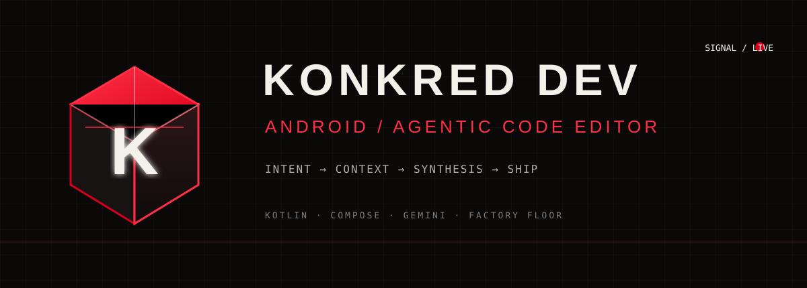

<!--
  KONKRED Dev — Android Agentic Code Editor
  FACTORY FLOOR system · Black #0A0908 · Signal Red #D60019 · Ink #F4F1EB

  Visual language: the K cube is the KONKRED mark — a compact machine for
  turning intent into executable code. All artwork lives in ./assets.
-->

<div align="center">

<a href="https://github.com/reARbitRA/KonkredDev-Android">
  
</a>

<br>

<a href="https://github.com/reARbitRA/KonkredDev-Android"></a>
<a href="https://github.com/reARbitRA"></a>
<a href="https://developer.android.com/studio"></a>

</div>


## THE EDITOR / THE AGENT / THE SIGNAL

**KONKRED Dev** is an Android code editor concept built around agentic development: a workspace where human intent becomes structured Kotlin implementation. The project is currently an AI Studio–generated Android application, wired for Gemini through the Secrets Gradle Plugin.

This README now uses the same visual grammar as the KONKRED profile: a local asset system, a persistent K-in-cube mark, red signal accents, and machine-readable project documentation.

```text
INTENT  →  CONTEXT  →  SYNTHESIS  →  REVIEW  →  SHIP
  user      project       Kotlin       human       Android
```


## OPERATING SURFACE

<table>
<tr>
<td width="33%" valign="top">

**01 / CAPTURE**

Translate a developer request into a concrete coding task.

</td>
<td width="33%" valign="top">

**02 / COMPOSE**

Generate and refine Android UI and Kotlin implementation in context.

</td>
<td width="33%" valign="top">

**03 / VERIFY**

Keep the human in the loop: inspect, build, test, and ship deliberately.

</td>
</tr>
</table>


## STACK TRACE / PROJECT SIGNAL

| Layer | Current signal |
|:---|:---|
| Platform | Android |
| Language | Kotlin |
| UI | Jetpack Compose |
| AI surface | Gemini / Firebase AI |
| Build | Gradle Kotlin DSL |
| Minimum SDK | 24 |
| Target SDK | 36 |

> The repository is Kotlin-first. The visual system is KONKRED-first. The implementation is still evolving.


## BOOT SEQUENCE

### Prerequisites

- [Android Studio](https://developer.android.com/studio) **or** a command-line toolchain: JDK 17+ and the Android SDK (compileSdk 36, Build-Tools 36.0.0)
- No manual Gradle install needed — the repository ships the Gradle wrapper (9.3.1), the minimum required by AGP 9.1.1
- An Android emulator or physical device (minSdk 24)
- A Gemini API key (only for live AI pairing; the editor works offline without one)

### Run locally

```bash
git clone https://github.com/reARbitRA/KonkredDev-Android.git
cd KonkredDev-Android
```

Create `.env` in the project root. Do not commit it:

```dotenv
GEMINI_API_KEY=your_gemini_api_key
```

Open the project in Android Studio, allow Gradle sync to complete, then run the `app` configuration on an emulator or device.

For a local debug build (uses the standard auto-generated AGP debug keystore — no setup required):

```bash
./gradlew assembleDebug
```

Run the JVM/Robolectric test suite:

```bash
./gradlew testDebugUnitTest
```

### Release build (signing)

The `release` build type signs with an upload keystore supplied via environment variables — none of which are committed:

| Env var | Purpose | Default if unset |
|---|---|---|
| `KEYSTORE_PATH` | Path to the upload keystore file | `${rootDir}/my-upload-key.jks` (not in repo) |
| `STORE_PASSWORD` | Keystore password | build fails |
| `KEY_PASSWORD` | Key password (alias must be `upload`) | build fails |

Generate a keystore once (keep it and its passwords out of version control):

```bash
keytool -genkeypair -v -keystore my-upload-key.jks -alias upload \
  -keyalg RSA -keysize 2048 -validity 10000
```

Then build:

```bash
KEYSTORE_PATH=$PWD/my-upload-key.jks STORE_PASSWORD=... KEY_PASSWORD=... ./gradlew assembleRelease
```

> Note: `GEMINI_API_KEY` from `.env` is compiled into the APK (BuildConfig). Restrict the key in Google Cloud Console to this app's package name (`com.aistudio.devcodeeditor.vscedt`) and signing certificate, and treat any key shipped in a client build as potentially extractable. A backend proxy is the recommended long-term fix (see `audit/07_final_report.md`, F-SEC-001).


## REPOSITORY MAP

```text
KonkredDev-Android/
├── app/                 Android application module
├── assets/              KONKRED README artwork
├── audit/               MVP readiness audit artifacts (reports, findings, scoring engine)
├── docs/                Privacy disclosure (draft) and policies
├── gradle/wrapper/      Gradle wrapper (9.3.1) + version catalog
├── gradlew / gradlew.bat  Wrapper launch scripts
├── .env.example         Local secrets template
├── build.gradle.kts     Root Gradle configuration
├── settings.gradle.kts  Project settings
└── README.md            This control surface
```


## ROADMAP / NEXT SIGNAL

- [ ] Make the editor surface explicit and production-ready
- [ ] Add project-aware context inspection
- [ ] Add Kotlin/Compose code synthesis flows
- [ ] Add review, diff, and rollback controls
- [ ] Add automated tests for generated output


<div align="center">
<a href="https://github.com/reARbitRA/KonkredDev-Android"></a>

<br>

<strong><a href="https://konkred.xyz">KONKRED</a> · <a href="https://github.com/reARbitRA">reARbitRA</a> · <a href="https://developer.android.com/">ANDROID</a></strong>

<sub>Concrete tools for abstract problems.</sub>

</div>
